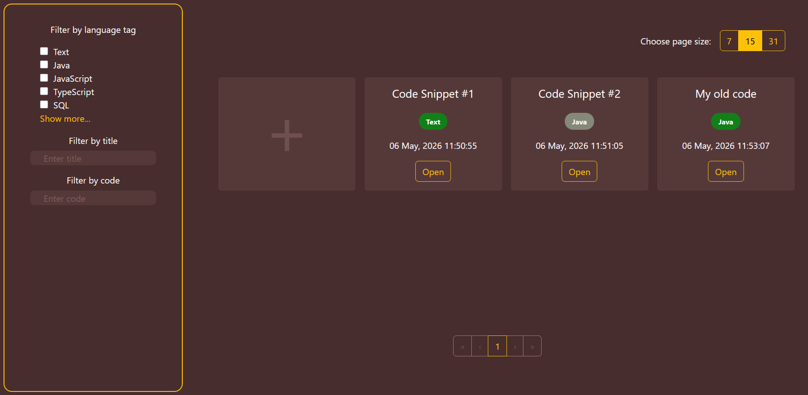
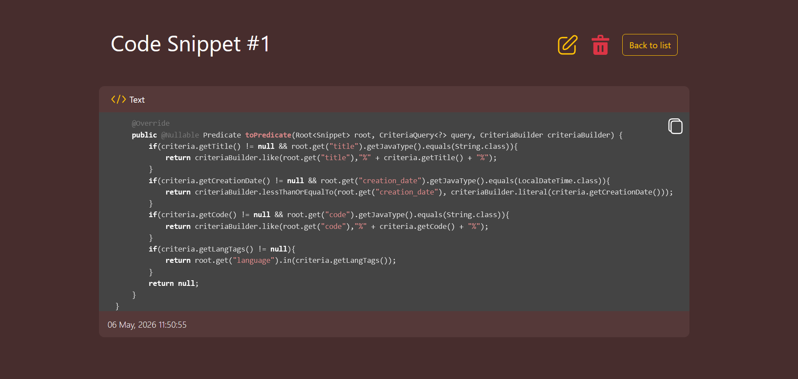

## Snippet Manager


[](https://github.com/FedorDevelopmer/snippet-manager/actions/workflows/ci.yaml)

A full-stack snippet management system designed for fast storage, search, and reuse of code fragments with syntax-aware organization.

---

## 📸 Screenshots

### Home page:


### Snippet page:


---

## 🚀 Features

- Full CRUD operations for code snippets
- Syntax highlighting
- Language tagging system
- Advanced filtering (title, code, language) using Criteria API
- Copy-to-clipboard support
- Swagger/OpenAPI documentation for an API
- Fully containerized (Docker + Docker Compose)
- Lightweight SQLite database for efficient and secure data storage
- CI pipeline with GitHub Actions

---

## 💻 Tech Stack

### Backend

- Java 17
- Spring Boot
- Spring Data JPA
- Hibernate
- SQLite
- JUnit + Mockito
- Maven

### Frontend
- React
- TypeScript
- Vite
- React Router
- React Bootstrap
- Vitest

### DevOps
- Docker
- Docker Compose
- GitHub Actions (CI)

---

## 🐳 Run with Docker


The application is fully containerized and can be started with a single command.


Run: ````docker compose up --build````

This will start:

- Backend (Spring Boot API) on http://localhost:9091
- Frontend (React SPA served via Nginx) on http://localhost:7000
- SQLite database stored in a Docker volume

After startup:
- API documentation (Swagger UI): http://localhost:9091/swagger-ui
- Frontend application: http://localhost:7000

Notes:
- On first run, the database file will be created automatically.
- No manual migrations are required.


---

## ⚙️ CI Pipeline

This project uses GitHub Actions to ensure code quality and build integrity on every push to `main`.

The pipeline runs automatically and includes:

- Backend build and unit tests (Maven + JUnit + Mockito)
- Frontend tests and build (Vite + Vitest)
- Docker build validation (ensures images can be built successfully)
#### Merging to `main` is restricted to successful pipeline runs (when branch protection rules are enabled).

---

## 🧪 Testing locally

Backend:
````./mvnw test````

Frontend:
````npm run test````

---

## 📦 Local Development

Backend:
````./mvnw spring-boot:run````

Frontend:
````npm install```` ->
````npm run dev````

---

## 🗂 Project Structure

snippet-manager/<br/>
├── data/ (SQLite persistence volume) <br/>&emsp;&emsp;├── data.db</br>
├── snippet-manager-back/ (Spring Boot REST API) <br/>
├── snippet-manager-front/ (React SPA) <br/>
├── docker-compose.yml (containerization) <br/>
└── README.md

---

## 📌 Notes

- SQLite persisted via Docker volume
- SPA routing handled via Nginx
- CI ensures build integrity

